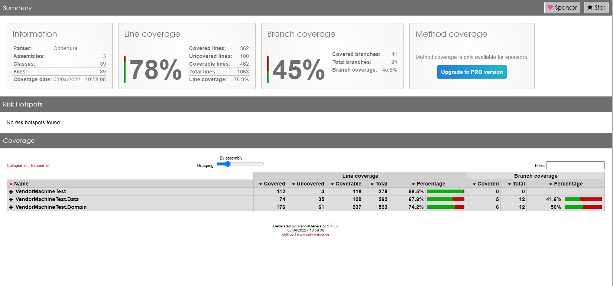

Vendor Machine
==============
BackEnd Technnologies
---------------------
C# (dotnet 6) - DDD Approach with SOLID principles applyed

Entity Framework Sql Server - Code first approach (Initial values being seed in the db migrations script) - Check folder : InitialData inside Data Project
	Overriding save changes to save automatically the field createdOn

CORS Configuration (Accept calls from Angular Project)

Swagger

MVVM pattern - Using AutoMapper

Repository Pattern with UOW (UOW unnecessary here since the machine can only be used by one person at time, however its important to avoid concurrent operations on DB)

MediatR Setup

Fluent Assert Validation Pattern

Back End Notes:
1 - Normally I do like to create another layer called "AppService", and pass to repository or service layer using that interface (SOLID). the purpose is to provide/manipulate informations for specific projects, but to keep the simplicity the mediator is connected straight to the repository layer;
2 - Relationship between entities/tables Sales and Product should be N -> N, generating one new table ProductSales in the midle (keep it like this to simplify);
3 - The database should have more 2 tables in order to controll the currencies (list of), and what currencies are accepeted in each machine (table currency_machine for example);
4 - To make it simple I kept all the endpoint in the same controller (It requires basically all the services to be injected in the same controller wich is not good);
5 - the starting point of angular project is get the machine by id (hardcoded because we know there is only one);

Tests XUnit
------------
Coverlet with Report Generator

Entity framework In Memory tests

Test Server

[Go to Test Report](https://github.com/fabiofos/DenTest/blob/master/BackEnd/VendorMachineTest/VendorMachineTest.Tests/CoverageReport/index.html)

Steps to Run
------------

**Back End Project**
1. Configure the connection string on appSettings (Api Project)
2. Run the migrations commands on Data Project
   - Add-Migration bd
   - Update-DataBase
3. Launch the API

** Front End Project **
1. run the command npm install; 
2. run the command npm install -g @angular/cli@11.2.2
3. run the command ng serve

DataBase Diagram 
----------------

Front End Technnologies
------------------------
Angular 11 - standard application (Only with bootstrap for simplicity)

Reactive Forms

Front End Notes:
1 - For Simplicity the model classes were not reproduced (all of then) in Angular Project (Thats why on the services layer the observables are dealing with "any" types);

Missing Features
----------------
1. Exact Coins strategy
2. Switch Language
3. Call Help (Api is ready to receive it, and the button is also on the UI, missing part is call it in angular service and indicate to the user)

Improvements (Suggestion)
-------------------------
1. Presuming the machine should be connected and not standalone, we should create some mechanism to update data in real time (SignalR for example);
2. Network trafic should be protected by HTTPS tunnel and another authorization such as JWT might have been configured in our API/UI.
